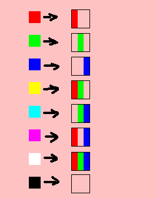
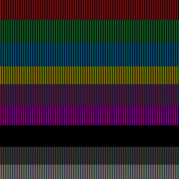

# pixelsplitter
Inspired by @pudding6145, this program iterates through each pixel of an image, splitting it into a 3x3 grid with a column for each RGB component. Works best with PNGs!



## Example
Source image:<br>

<br>
Split image:<br>


## Usage:
```
pixelsplitter.py [-h] source_path output_path

Splits the pixels of an image into their RGB components

positional arguments:
  source_path
  output_path

options:
  -h, --help   show this help message and exit
```
Requires **argparse** and **pillow** libraries to work
